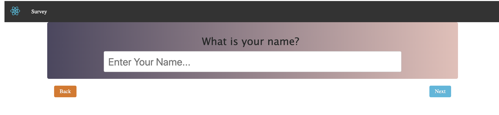

# ES6 React boilerplate using Webpack

- [x] React 16.5.2
- [x] ECMAScript 6+ and JSX support
- [x] React Router v4
- [x] Latest Webpack (v.4.16.5), Babel 7 and Webpack Dev Server (v.4.19.1) with Scope Hoisting enabled
- [x] Hot Module Replacement using [react-hot-loader]
- [x] ES6 linting with continuous linting on file change
- [x] SASS support
- [x] Separate CSS stylesheets generation
- [x] Automatic HTML generation
- [x] Production Config
- [x] Custom Babel Preset with Decorators, Class Properties, Rest/Spread operator support
- [x] Export Separate Vendor Files

## Starting the dev server

Make sure you have the latest Stable or LTS version of Node.js installed.

1. `git clone https://github.com/vishnuksharma/react-webpack-survey.git`
2. Run `npm install`
3. Start the dev server using `npm start`
3. Open [http://localhost:8080](http://localhost:8080)

## Available Commands

- `npm start` - start the dev server
- `npm clean` - delete the dist folder
- `npm run production` - create a production ready build in `dist` folder
- `npm run lint` - execute an eslint check

## Production code

Run `npm run production`. The production-ready code will be located under `dist` folder.

## Layout View
